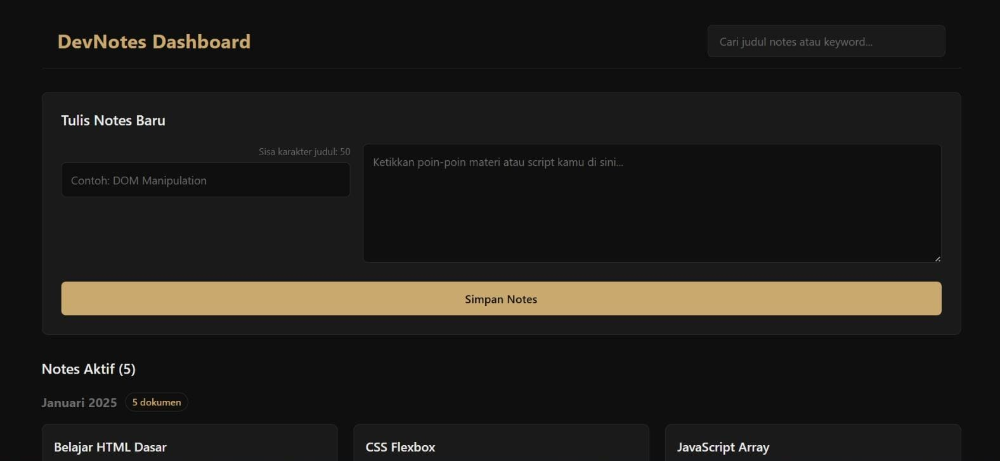
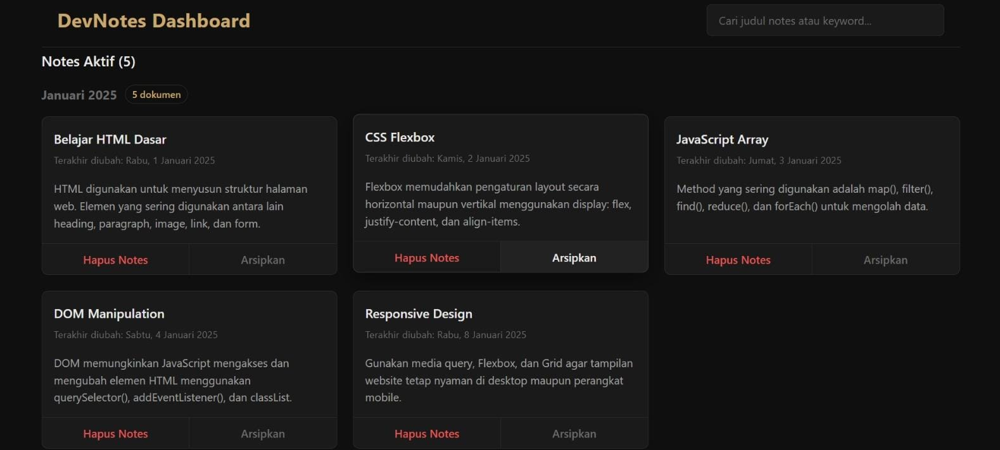
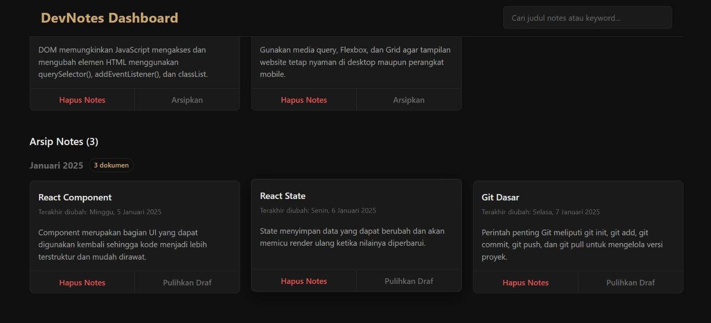

# DevNotes Dashboard 

A web-based note management application built with React, designed to store programming notes, scripts, or daily notes in an organized and efficient way.

## Features
- **Add Note:** Create new notes with title validation (max 50 characters)
- **Search Notes:** Real-time search by keyword in note title and body
- **Archive Note:** Move active notes to archive section
- **Restore Note:** Move archived notes back to active list
- **Delete Note:** Permanently delete notes from dashboard or archive
- **Keyword Highlighting:** Highlights search keywords in note title and body
- **Grouped by Month:** Notes grouped by month and year for better organization

## Tech Stack
- React.js
- Vite
- JavaScript (ES6+)
- CSS Custom Properties

## Project Structure

    src/
    ├── components/
    │   ├── App.jsx
    │   ├── NoteInput.jsx
    │   ├── NotesList.jsx
    │   ├── NoteItem.jsx
    │   ├── NoteSearch.jsx
    │   └── NoteActionButton.jsx
    ├── styles/
    │   └── style.css
    └── utils/
        └── index.js

## How to Run
1. Clone this repository
2. Install dependencies: `npm install`
3. Start development server: `npm run dev`
4. Open browser at `http://localhost:5173`

## Screenshot

## Author
Aah Hayatul Karimah

