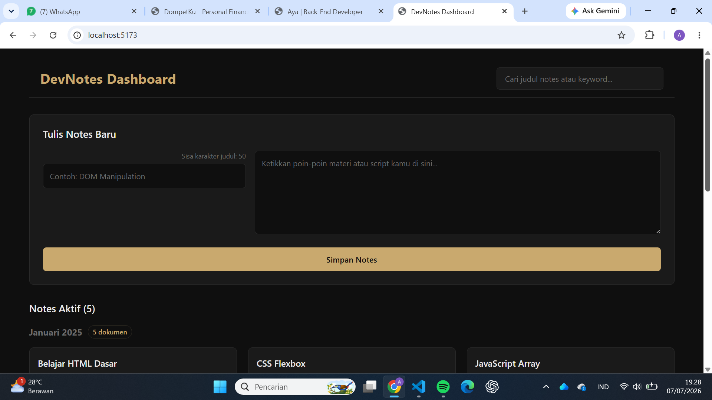
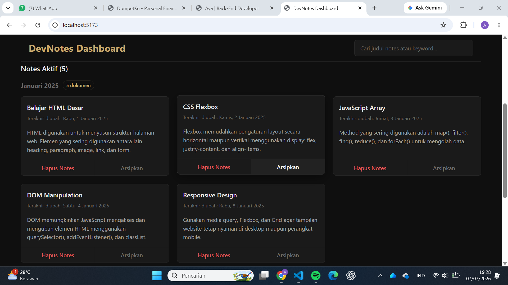
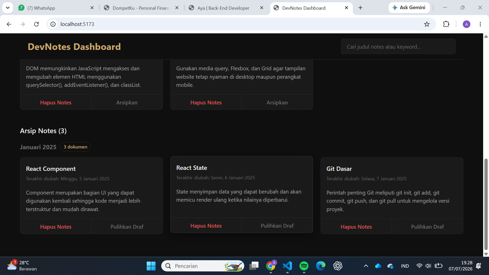

# DevNotes Dashboard

DevNotes Dashboard adalah aplikasi manajemen catatan berbasis web yang dirancang khusus untuk menyimpan poin-poin materi pemrograman, script, atau catatan harian secara rapi. Proyek ini awalnya dikembangkan sebagai submission Dicoding, lalu dibangun dan dimodifikasi ulang dengan sentuhan UI personal yang lebih modern dan fungsional.

---

## Fitur Utama

Aplikasi ini dilengkapi dengan fitur manajemen catatan (CRUD sederhana) yang interaktif:

- **Tambah Catatan Baru:** Membuat catatan dengan validasi batas maksimal karakter judul (maksimal 50 karakter).
- **Cari Catatan:** Fitur pencarian dinamis berdasarkan kata kunci judul secara real-time.
- **Arsipkan Catatan:** Memisahkan catatan aktif ke dalam daftar arsip agar dasbor tetap rapi.
- **Pulihkan dari Arsip:** Mengembalikan catatan yang diarsipkan kembali ke daftar catatan aktif.
- **Hapus Catatan:** Menghapus catatan secara permanen dari dasbor maupun arsip.

---

## Teknologi yang Digunakan

Proyek ini dibangun menggunakan ekosistem Front-End web development modern:

- **React.js** – Library utama untuk membangun UI berbasis komponen.
- **Vite** – Build tool modern untuk pengalaman pengembangan yang cepat.
- **JavaScript (ES6+)** – Manipulasi data menggunakan array methods seperti filter(), map(), dan lainnya.
- **CSS Custom Properties** – Styling kustom untuk mendukung tema dark mode yang nyaman di mata.

---

## Struktur Folder Proyek

```text
src/
├── components/          # Komponen UI modular (Card, Search, Board, Editor)
│   ├── App.jsx
│   ├── DevNoteBoard.jsx
│   ├── DevNoteButton.jsx
│   ├── DevNoteCard.jsx
│   ├── DevNoteEditor.jsx
│   └── DevNoteSearch.jsx
├── styles/
│   └── style.css        # Pusat manajemen styling dan variabel warna
└── utils/
    └── data.js          # Initial data dummy untuk catatan
```

## Screenshot




